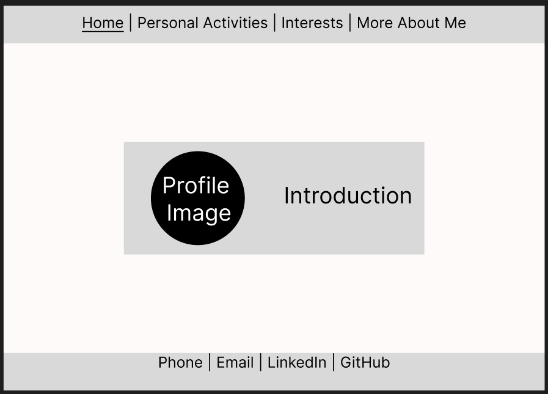
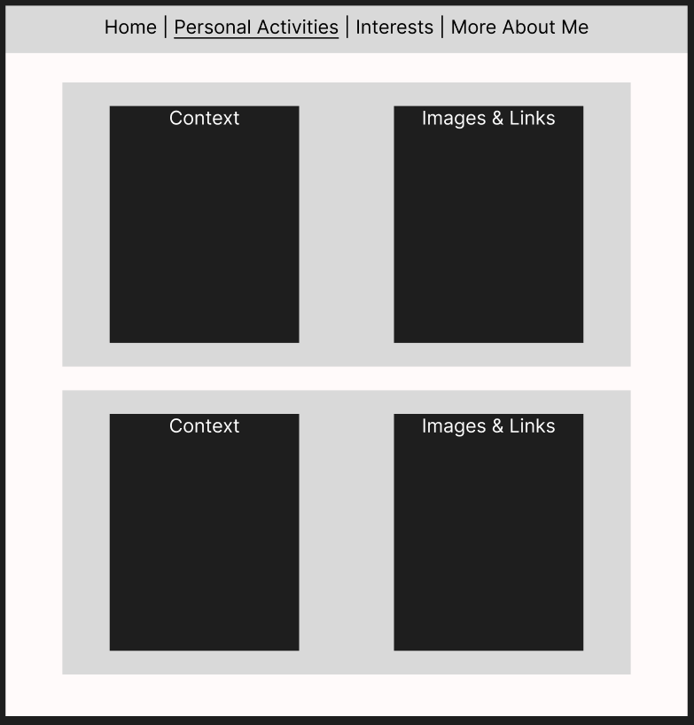
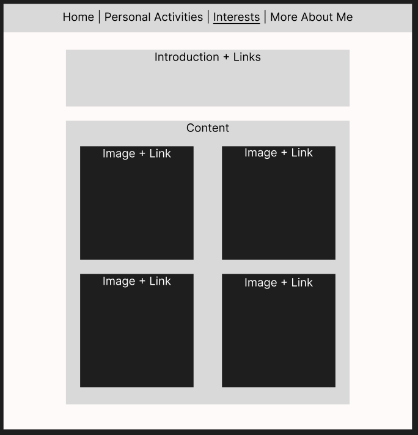
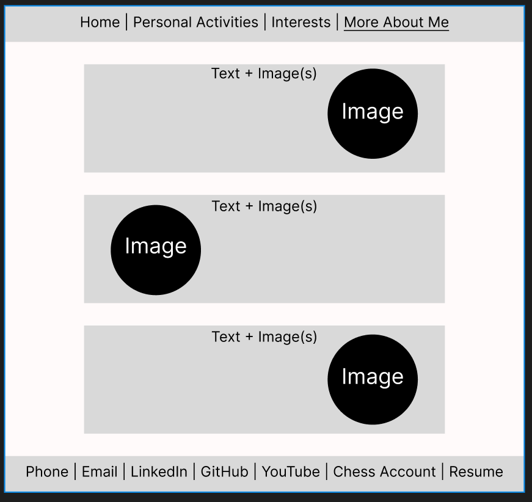

# niickzl.github.io
Nick's Website Overview:
This is a personal website covering some information about myself including topics like personal activities, interests of my own. 
Some features I've implemeted are click-able icons, zoom-in-able images, and a drop-down bar.

-----------------------------------------------------------------------------------------------------------------------------------------------------

Nick's LICENSE choice explaination:
I chose the MIT License as it is said to be the "leanest license".
Moreover, my website was no private technology/patent, meaning I had no need of preventing people from using it.

I learned about the MIT and other licenses from [GitHub Gist](https://gist.github.com/nicolasdao/a7adda51f2f185e8d2700e1573d8a633#1-mit)

-----------------------------------------------------------------------------------------------------------------------------------------------------

Nick's Personal Website Wireframes:

Homepage Wireframe:

Header:
    Left: Name
    Middle: Nav links (Home | Personal Activities -> (Projects | Competitions) | Interests -> (Photography | Chess) | More About Me)
    Right: Location

Hero Section:
    Large profile image
    Introduction & Welcome visitors & Reminder of feature

Footer:
    Phone | Email | LinkedIn | GitHub

-----------------------------------------------------------------------------------------------------------------------------------------------------

Personal Activities & Interests Wireframe:

Personal Activities:

Interests:

Header:
    Left: Name
    Middle: Nav links (Home | Personal Activities -> (Projects | Competitions) | Interests -> (Photography | Chess) | More About Me)
    Right: Location

Hero Section:
    Large text on title of topic & Medium text on context
    Click-able icon linking to additional information
    Zoom-able image to illustrate topic

-----------------------------------------------------------------------------------------------------------------------------------------------------

More About Me Wireframe:

Header: 
    Left: Name
    Middle: Nav links (Home | Personal Activities -> (Projects | Competitions) | Interests -> (Photography | Chess) | More About Me)
    Right: Location

Hero Section:
    Split into 4 rows:
        Row 1: Profile image and description about me
        Row 3: (Past) My background
        Row 4: (Future) My desire for the future

Footer:
    Thank Visitor
    Additional Links (Phone | Email | Linkedin | GitHub | YouTube | Chess | Resume)